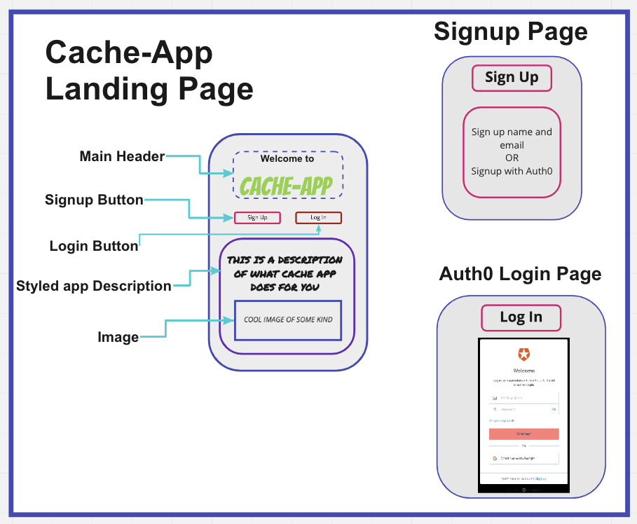
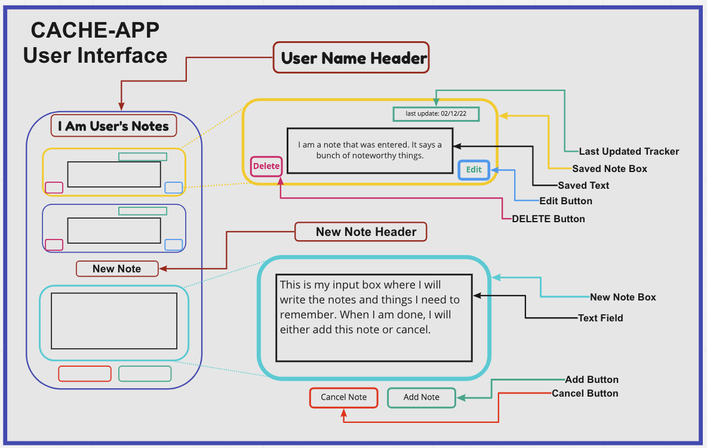
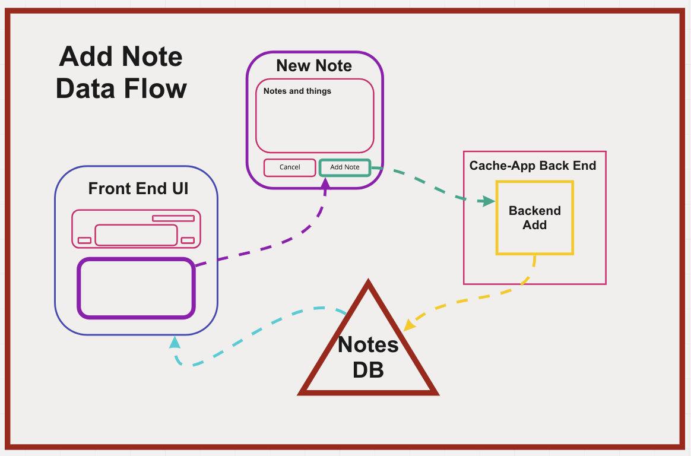

# How To Use **Cache-App**

## Step One

- begin by running:
- `git clone` then copy and paste `git@github.com:Ethicus-Optimus/socialdev-front.git`

- Do the same for the backend repo:
- `git clone` then copy and paste `git@github.com:Ethicus-Optimus/socialDev-Back.git`

## Step Two

- run: `cd socialdev-front`
- then (installs node modules): `npm install`
- then (installs dependencies): `npm i express bootstrap nodemon cors dotenv mongoose jwt bcrypt base-64 supertest sqlite3 jsonwebtoken`
- repeat **step two** for 'backend'

## Step Three

- Your are going to need to create a `.env` in order to use the server, follow the guide in the provided `.sample.env` file.

## How to Use

## To start server

- run: `npm start`
*To test the server*

- run: `npm run test`
*To run the tests*

## Models

### Cache-App

- An application for the tracking of relevant development notes organized with a social media feel.

### Problem Domain/Pain Point

- Note compiling for relevant usage
- Making development note taking more fun and engaging
- Add a collaborative feel to taking notes

### MVP

- Take notes and categorize.
- Be able to share, post, delete, and add notes.

### User Authorization

- For profile owners:
  - Manage profile details
  - Manage notes feed

### User Stories - "As a note creator..."

- I want to be able to add notes I find relevant or useful.
- I want to be able to delete notes.
- I want to be able to view my friend's notes.
- I want to be able to edit my profile details.

### Stress Goals

- Likes/UpVotes
- Edit posted notes
- Add photos/videos feature
- Hints and suggested content/users
- Study groups

### UMLs and Wireframes

### Features

- Create Notes
- Read Notes
- Add Notes
- Update Notes
- Delete Notes

### Deployed Server

- Front end: [Cache-App](https://brave-jepsen-8e8769.netlify.app/)
- Server side: [Cache-App](https://ethicus-optumus.herokuapp.com/posts)

### Change Log

- Version 1.0 completed 18 March 2022
  - Basic application functionality achieved.

### Error Handling

- Sends a 404 error if the route or method is unavailable.
- Sends a 500 error for internal server issues.

### Testing

[TESTS](./public/assets/tests.png)

### Credit and Co-Conspirators

- This amazing final project was thoughtfully created and masterfully crafted by the master-minds of **Matt Miguel**, **Michael Hendricks**, **Joey Hernandez**, **Dario Vitorte**, and **Ryan Lee**
